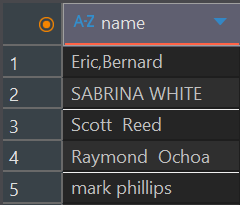
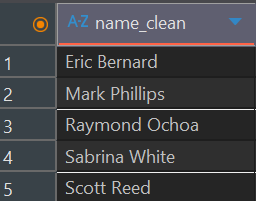
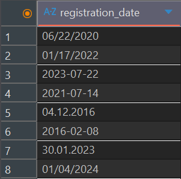
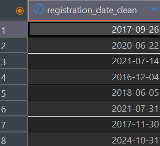
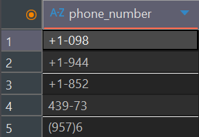
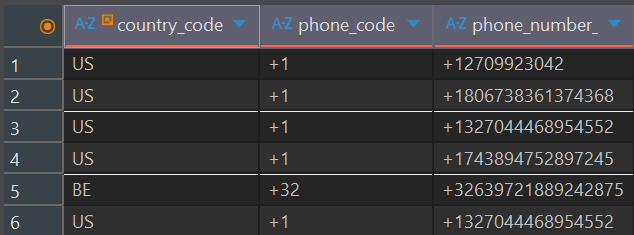

# E-Commerce Data Cleaning Project w/PostgreSQL

## Inhalt
[Hintergrund und Übersicht](#hintergrund-und-übersicht)

[Datenstruktur](#datenstruktur)

[Kurzzusammenfassung](#kurzzusammenfassung-und-datenqualitätsprotokoll)

[Analyse und Korrektur typischer Fehler](#analyse-und-korrektur-typischer-fehler)

[Genutzte Kenntnisse](#genutzte-kenntnisse)
<br> </br>

## Hintergrund und Übersicht
Das Unternehmen **Gamezone** vertreibt neue und gebrauchte Gaming-Produkte sowohl über eine eigene Website als auch über eine mobile App. Die vorliegenden Transaktions-, Kunden- und Regionsdaten sind jedoch stark fehlerbehaftet.

Dieses Projekt widmet sich daher der Qualitätskontrolle solcher Daten. Während die Datenbereinigung ein fester Bestandteil jedes Datenprojekts ist, liegt der Schwerpunkt hier explizit auf der **systematischen Qualitätskontrolle**. Dabei wird gezeigt, wie Datensätze auf Fehler geprüft, diese Fehler analysiert und bewertet sowie - sofern möglich - korrigiert werden.
<br> </br>


Zum vollständige SQL-Code zur Fehleranalyse und Korrektur pro Tabelle geht es [hier](/Skripte/)  
Zu einer Ausführung der genutzten Kenntnisse geht es [hier](#genutzte-kenntnisse)
<br> </br>

## Datenstruktur
Die Datenbasis des Unternehmens umfasst drei zentrale Tabellen:
- Order_data mit Informationen über einzelne Transaktionen
- Customer_data mit ausführlichen Kundendaten
- Region_data, welche die Zuordnung der Länder zu Weltregionen enthält.

Die Transaktionstabelle umfasst insgesamt 21.864 Einträge.
Zusätzlich wurde aus einer externen Quelle eine Tabelle mit Ländervorwahlen integriert, um fehlende Vorwahlen in den Kundentelefonnummern zu imputieren.


<br> </br>

## Kurzzusammenfassung und Datenqualitätsprotokoll
Insgesamt wurden 20 Datenqualitätsprobleme identifiziert. Davon konnten sieben nicht gelöst werden. Die Mehrheit dieser unlösbaren Probleme entstand durch fehlende Werte, die sich nicht aus anderen Quellen ableiten ließen. Darüber hinaus bestehen Probleme, die Rücksprache mit anderen Teams ob der Problemursache erfordern. Dazu gehören doppelte IDs, fehlerhafte Versanddaten und nicht zugeordnete Ländercodes. 

Alle bereinigten Datensätze wurden in einer neuen Tabelle gespeichert, sodass die Rohdaten unverändert erhalten bleiben. Darüber hinaus wurde der Datensatz um zusätzliche Spalten angereichert, beispielsweise time_to_ship sowie in Einzelkomponenten aufgeteilte Adressinformationen, um eine detailliertere Analyse zu ermöglichen.


Diese Tabelle dokumentiert alle aufgetretenen Fehler, ihren Einfluss auf die Datenanalyse sowie den Umgang mit dem Problem (als Tabelle [hier](/Datenqualitätsprotokoll.xlsx)). Die verschiedenen Problemtypen, ihre Analyse und der gewählte Lösungsansatz werden im Folgenden beispielhaft genauer dargestellt. 

Die vollständigen Skripte zur Fehleranalyse und Fehlerkorrektur für die einzelnen Tabellen können hier eingesehen werden.
- order_data: [Fehleranalyse](/Skripte/Fehleranalyse%20order_data.sql) / [Fehlerkorrektur](/Skripte/Korrektur%20order_data.sql)
- customer_data: [Fehleranalyse](/Skripte/Fehleranalyse%20customer_data.sql) / [Fehlerkorrektur](/Skripte/Korrektur%20customer_data.sql)
- region_data: [Fehleranalyse](/Skripte/Fehleranalyse%20region_data.sql) / [Fehlerkorrektur](/Skripte/Korrektur%20region_data.sql)
<br> </br>

## Analyse und Korrektur typischer Fehler

### Duplikate
Alle Spalten, die eindeutige Werte enthalten sollten, wurden systematisch auf Duplikate überprüft. Dabei zeigte sich, dass in der Spalte order_id insgesamt 145 doppelte Einträge vorhanden sind. Aus diesem Grund konnte für diese Spalte kein Primary Key etabliert werden.

```sql
SELECT order_id, COUNT(*) AS count
FROM order_data
GROUP BY order_id
HAVING COUNT(*) > 1;
```
Sich wiederholende IDs in den Bestelldaten wurden nicht entfernt, um erst Rücksprache zur Problemursache zu halten (falscher Eintrag oder falsche ID). Stattdessen wurde der jeweils zweite Fall einer ID mit einem '_DUP' am Ende markiert, um einzigartige IDs zu erhalten.

```sql
-- FINDEN DOPPELTER IDs --
WITH order_double AS(
    SELECT order_id, COUNT(*)
    FROM order_data
    GROUP BY order_id
    HAVING COUNT(*) > 1
),

-- FINDEN DES JEWEILS ZWEITEN FALLS --
double_numbered AS(
    SELECT ctid, order_id, 
        row_number() OVER (PARTITION BY order_id) AS row_num
    FROM order_data
    WHERE order_id IN (SELECT order_id FROM order_double)
)

-- MARKIEREN DOPPELTER ORDER_IDS mit _DUP --
SELECT  
CASE
	WHEN dn.row_num = 2 THEN CONCAT(od.order_id, '_DUP')
	ELSE od.order_id
END AS order_id_clean
FROM order_data od
LEFT JOIN double_numbered dn ON od.ctid = dn.ctid;
```
<p style="margin:2px;">&nbsp;</p>

### Tippfehler und inkonsistente Schreibweisen
Von Nutzern eingegebene Daten enthalten häufig Tippfehler oder inkonsistente Formatierungen. Davon betroffen waren insbesondere die eingegebenen Namen, Adressen, E-Mail-Adressen und Telefonnummern. Typische Probleme sind doppelte Leerzeichen, unerwünschte Sonderzeichen sowie uneinheitliche Groß- und Kleinschreibung, die bereinigt werden müssen. 

<table>
  <tr>
    <td style="vertical-align: top; padding-right: 15px;">

<pre><code class="language-sql">SELECT name
FROM customer_data
WHERE name !~ '^[A-Z][a-z]+(?:\s[A-Z][a-z]+)*$';
</code></pre>

  </td>
    <td>
      
    </td>
  </tr>
</table>

Zwar lassen sich nicht alle Tippfehler (z. B. innerhalb von Namen) vollständig bereinigen, doch können die Daten um diese typischen Formatierungsfehler bereinigt und dadurch vereinheitlicht werden.


<table>
  <tr>
    <td style="vertical-align: top; padding-right: 15px;">

<pre><code class="language-sql">SELECT
  CASE
	WHEN name LIKE '%,%' THEN INITCAP(REPLACE(name, ',', ' '))
	WHEN name LIKE '%  %' THEN INITCAP(REPLACE(name, '  ', ' '))
ELSE INITCAP(name) 
END AS name_clean
FROM order_data;
</code></pre>

  </td>
    <td>
      
    </td>
  </tr>
</table>

Ein weiteres Beispiel für nicht korrigierbare Tippfehler sind fehlende „@“-Zeichen bei E-Mail-Adressen, die nicht eindeutig einem bekannten Mailprovider zugeordnet werden können. Eine vollständige Darstellung der vorgenommenen Bereinigung und Formatierung der Kundendaten kann [hier](/Skripte/Korrektur%20customer_data.sql) nachgelesen werden.
<br> </br>

### Falsche Kategorisierung
Sowohl in den Transaktions- als auch in den Regionsdaten befanden sich sich Kategoriebenennungen, die Tippfehler enthielten oder zusammengefasst werden konnten. Beispielsweise befanden sich zwei Schreibweisen von 'North America' sowie eine nicht vorhandene Region in der Liste an distinkten Regionen.

<table>
  <tr>
    <td style="vertical-align: top; padding-right: 15px;">

<pre><code class="language-sql">SELECT region, COUNT(*)
FROM region_data
GROUP BY region;
</code></pre>

  </td>
    <td>
      
    </td>
  </tr>
</table>

Anhand der zugehörigen Ländercodes konnte bestätigt werden, dass beide Kategorien zu Nordamerika gehören. Auch bei dem X.x Eintrag und sogar den leeren Werten war anhand der zugeordneten Länder eindeutig, welche Region hier eingefügt werden muss.

<table>
  <tr>
    <td style="vertical-align: top; padding-right: 15px;">

<pre><code class="language-sql">SELECT
CASE
	WHEN region = 'X.x' THEN 'APAC'
	WHEN region = 'North America' THEN 'NA'
	WHEN region = '' THEN 'EMEA'
	ELSE region
END AS region_clean

FROM region_data;
</code></pre>

  </td>
    <td>
      
    </td>
  </tr>
</table>

### Falsch formatierte Daten
Bei Daten mit einem festgelegten Zielformat, etwa Telefonnummern oder Datumsangaben, kommt es ohne klare Eingaberegeln häufig zu uneinheitlichen Formaten. Besonders beim Registrierungsdatum traten verschiedene Sonderzeichen sowie abweichende Reihenfolgen von Tag, Monat und Jahr auf. Daher musste vor der Korrektur sichergestellt werden, was für verschiedene Formate vorliegen. 

<table>
  <tr>
    <td style="vertical-align: top; padding-right: 15px;">

<pre><code class="language-sql">SELECT registration_date
FROM customer_data
WHERE registration_date !~ '^\d{4}-\d{2}-\d{2}$';
  
-- Bestätigung der Datenformate bezüglich Platzierung von Tag und Monat
SELECT COUNT(*)
FROM customer_data
WHERE SUBSTRING(registration_date FROM 1 FOR 2)::int > 12
  AND registration_date ~ '^\d{2}/\d{2}/\d{4}$';</code></pre>

  </td>
    <td>
      
    </td>
  </tr>
</table>

Nachdem sämtliche abweichenden Datumsformate identifiziert worden waren, konnten diese in ein einheitliches Format überführt werden. Dadurch ließen sich auch weiterführende Analysen des Registrierungsdatums durchführen, die zuvor aufgrund der String-Formatierung nicht möglich waren.

<table>
  <tr>
    <td style="vertical-align: top; padding-right: 15px;">

<pre><code class="language-sql">SELECT
CASE
	WHEN registration_date ~ '^\d{2}/\d{2}/\d{4}$' THEN to_date(registration_date, 'MM/DD/YYYY')
	WHEN registration_date ~ '^\d{2}\.\d{2}\.\d{4}$' THEN to_date(registration_date, 'DD.MM.YYYY')
	WHEN registration_date ~ '^\d{4}-\d{2}-\d{2}$' THEN to_date(registration_date, 'YYYY-MM-DD')
END AS registration_date_clean,
FROM customer_data;</code></pre>

  </td>
    <td>
      
    </td>
  </tr>
</table>

### Unplausible Daten
Unplausible Daten sind Daten, die auf den ersten Blick als inkorrekt oder nicht nutzbar zu identifizieren sind. Im vorhandenen Datensatz waren dies z.B. Telefonnummern, die nur weniger als acht Stellen enthalten, oder auch Versanddaten, die vor dem Bestelldatum lagen.
<table>
  <tr>
    <td style="vertical-align: top; padding-right: 15px;">

<pre><code class="language-sql">SELECT COUNT(*)
FROM customer_data
WHERE CHAR_LENGTH(phone_number) < 8;</code></pre>

  </td>
    <td>
      
    </td>
  </tr>
</table>

Die Telefonnummern wurden aus dem Datensatz entfernt, um auf fehlende Kundeninformationen aufmerksam zu machen ([vollständiger Code hier](/Skripte/Korrektur%20customer_data.sql)). Die Versanddaten hingegen wurden aufgrund des hohen Anteils an fehlerhaften Einträgen zunächst beibehalten, um in Rücksprache die Ursachen für diese Abweichungen zu klären.
<p style="margin:2px;">&nbsp;</p>

### Fehlende Werte
Fehlende Werte können nur dann korrigiert werden, wenn sie aus einer anderen Informationsquelle abgeleitet werden können. So wurde im Abschnitt Falsche Kategorisierung bereits ein Beispiel gezeigt, bei dem fehlende Regionen anhand der im Datensatz enthaltenen Länderdaten ergänzt werden konnten. Auch in vielen Telefonnummern fehlten Ländervorwahlen. Da die Herkunftsländer der Kunden bekannt waren, konnten diese Vorwahlen mithilfe einer externen Referenztabelle zu Länder- und Telefoncodes ergänzt werden. 

```sql
UPDATE customer_data_clean cdc
SET phone_number_clean = CONCAT(cpc.phone_code, cdc.phone_number_clean)
FROM order_data_clean odc
JOIN country_phone_codes cpc 
	ON cpc.country_code = odc.country_code_clean
WHERE cdc.user_id = odc.user_id
	AND cdc.phone_number_clean NOT LIKE '%+%'; 
  ```

 

Alle weiteren fehlenden Werte ließen sich nicht imputieren und wurden daher - gemeinsam mit der Einschätzung ihres Einflusses auf die Analyse - im Datenqualitätsprotokoll dokumentiert.
<br> </br>

## Genutzte Kenntnisse
- **Analyse von Fehlern mit PostgreSQL:** u.a. Identifikation von Duplikaten mit `PARTITION BY`, Überprüfung von Kategorien mit `GROUP BY` sowie Analyse von Formatierungen mithilfe von regulären Ausdrücken (REGEX)

- **Fehlerkorrektur mit PostgreSQL:** u.a. Anpassung und Vereinheitlichung von Kategorien mit `CASE`-Statements, Umwandlung von Datumsformaten mittels `TO_DATE` sowie Imputation fehlender Vorwahlen durch den Abgleich mit einer externen Quelle über `JOIN`

- **Datenmodellierung**: Erstellung und Definition von Primary Keys und Foreign Keys zur Sicherstellung von Konsistenz und referenzieller Integrität

- **Dokumentation:** Übersichtliche und vollständige Darstellung identifizierter Fehler, deren Dringlichkeit sowie genutzter Lösungswege für eigene Referenz und zur Kommunikation im Team

- **Funktionalität DBeaver**

<br> </br>
Die Daten stammen von einem fiktionalen Unternehmen und können [hier](/Daten) eingesehen werden. Sie sind zum Teil KI geneneriert, während die Ländervorwahlen aus dem [Web](https://www.bws.net/toolbox/country-codes) entnommen sind.